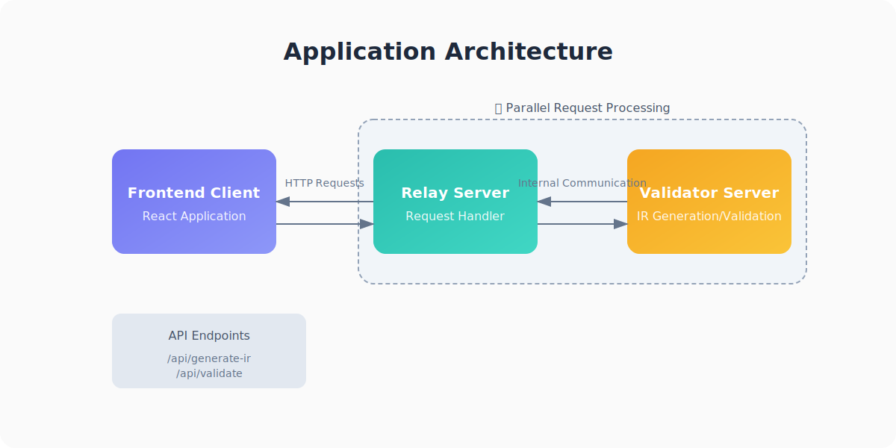

# translation validator

## overview
this tool compares the source function in cpp with the target function in rust, and verifies whether the rust function is a correct translation/semantic equivalent of the cpp function using alive2 in llvm ir level.

**ps**. you could find all provided source files to be verified in the [examples/source](./examples/source) directory.

## prerequisites
- follow the instructions in [alive2](https://github.com/AliveToolkit/alive2) to build and configure alive2, and also the specific llvm version.
  - you should build the llvm from source (i.e., the latest main branch), with RTTI and exceptions turned on.

- based on the provided `CMakeLists_Template`, create your own `CMakeLists.txt` by replacing the placeholder for the paths, you may need to change the `.dylib` to `.so` or `.a` depending on your OS.

## standalone version
please note that the translation validator has two different versions, one is the **standalone** version which could be directly run through terminal through the following commands; the other is the **full-stack** version that needs the frontend (see [validator-frontend](./validator-frontend) for more details) + the backend (`RelayServer` in [relay_server](./relay_server) and `ValidatorServer` in [ValidatorServer.h](./src/ValidatorServer.h)).

the following sections are especially for running the standalone version, prior to that, you should've already built the alive2 following the above instructions.

### build and run
through `make build_standalone`, `make run_standalone`, or `make build_and_run_standalone`.

the complete form, if using the first command, is:
```bash
make run_standalone <function_name> [--fixed] [ARGS="--cpp-func=<cpp_function_name> --rust-func=<rust_function_name>"]
```

the `--fixed` option is forcing the validator to select the ir files in the [examples/ir_fixed](./examples/ir_fixed) directory, it will select the ir files in the [examples/ir](./examples/ir) directory by default.

the `ARGS` option is the arguments to specify a specific function name to be verified for the source (cpp) and target (rust) when there are multiple functions in the generated ir files, this is mainly because the validator is only able to verify the **one-to-one** mapping between the cpp and rust functions.

**note**: the `compile_commands.json` in the root directory is a dynamic link to the `compile_commands.json` in the build directory, which will be automatically generated through the building process by `cmake`, this is generally used by `clangd` for code navigation, you may need to reload the window to make it work.

### workflow
the standalone version generally follows the workflow, i.e.,
1. creating the cpp and rust source files in the [examples/source](./examples/source) directory, you could refer to the provided source files for more details.

2. generating the ir files through `make generate_ir` or `make clean_and_generate_ir`.
   - this will (clean and) generate the ir files for all the source files in the [examples/source](./examples/source) directory, the generated ir files will be put in the [examples/ir](./examples/ir) directory.

3. validate the ir files by running the corresponding command depending on the verification purpose.

4. check the result from your terminal for feedback of the semantic equivalence.

**note**: the source file, e.g., `examples/source/add.rs`, will be converted to `add_rs.ll` and put in the `examples/ir/add/add_rs.ll` path, check the [scripts/src2ir.py](./scripts/src2ir.py) for more details.

### ir_fixed?
the [examples/ir_fixed](./examples/ir_fixed) directory is a collection of the ir files that are manually "fixed" by me, you could compare them with the ir files in the [examples/ir](./examples/ir) directory to see the differences, there may be an accompanying `note.md` file in each directory to record the changes made and the reasons.

**note**: the [examples/ir_fixed](./examples/ir_fixed) directory contains the ir files generated locally from macOS, you may need to re-generate the ir files from the source files and make the same changes according to the `note.md` if you are using a different platform.

## full-stack version
### overview
the infrastructure of the full-stack version is relatively simple,
- the backend consists of `RelayServer` and `ValidatorServer`.
  - `RelayServer` is responsible for receiving the requests (i.e., `/api/generate-ir` and `/api/validate`) from the frontend, and sending the requests to the `ValidatorServer` for the actual verification.
  - `ValidatorServer` is responsible for generating/validating the ir files and sending the results back to the `RelayServer`.
  - do note that the two servers support **parallel requests** and **concurrent executions**, i.e., the requests are processed concurrently and do not interfere with/block each other.
- the frontend is a [react](https://react.dev/) application, see [validator-frontend](./validator-frontend) for more details.



### build and run locally
before running the following commands, you should have already built the project by `make build`, this will build the `RelayServer`, `ValidatorServer`, and the standalone version.

- first you should start the backend servers, i.e., `RelayServer` and `ValidatorServer`.
  - start the `ValidatorServer` by `make run_validator_server`.
  - start the `RelayServer` by `make run_relay`.

- then you could start the frontend server by `npm run dev`, see [validator-frontend](./validator-frontend) for more details.

- you should now be able to start the validation by opening [http://localhost:3000/](http://localhost:3000/) in your browser.

**note**: the `RelayServer` and `ValidatorServer` will be running on port `3001` and `3002` by default, make sure these ports are not being used by other services/applications.

## practicality and impracticality
before talking about the practicality and impracticality of the translation validator, let's first see how does alive2 check the semantic equivalence of two LLVM IR functions.

### refinement

### encoding

### SMT solver (z3)

