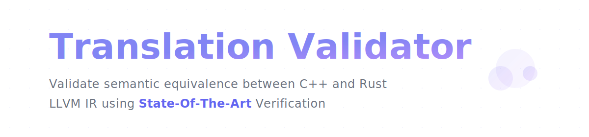

## Overview
this tool verifies semantic equivalence between C++ and Rust functions by performing translation validation at the LLVM IR level using [Alive2](https://github.com/AliveToolkit/alive2).

given a source C++ function and its target Rust translation, it:

- compiles both functions to LLVM IR using their respective frontends (`clang++`/`rustc`)
- verifies whether the target IR **refines** the source IR through alive2's validation logic
- reports detailed validation results and potential semantic mismatches

a key insight is that the validation happens at the IR level where language-specific semantics (like overflow behavior) are encoded into LLVM IR (which is converted to alive2's IR during validation process) attributes and instructions.

## Prerequisites
due to [alive2](https://github.com/AliveToolkit/alive2)'s rapid development and its requirements/recommendations to always be built based on the latest LLVM `main` branch, I packed a recent snapshot (i.e., Mid Oct 2024) of alive2 in the [alive2_snapshot](./alive2_snapshot) with only the relevant dependencies/modules and custom changes to be compatible with the latest **default** LLVM version(s).

to keep the consistency between each compilation, it's recommended to use `llvm-19` to build both `alive2_snapshot` and the translation validator - you will be prompted to install `llvm-19` if you don't have it.

to build `alive2_snapshot`, you could either run `make build_alive2` or triggers a full build by `make full_build`, see [build_alive2_snapshot.sh](./scripts/build_alive2_snapshot.sh) and [build.sh](./scripts/build.sh) for more details.

**note**: using different versions of `llvm` may cause compatibility issues during compilation.

## Standalone Version
please note that the translation validator has two different versions, one is the **standalone** version which could be directly run through terminal through the following commands; the other is the **full-stack** version that needs the frontend (see [validator-frontend](./validator-frontend) for more details) + the backend (`RelayServer` in [relay_server](./relay_server) and `ValidatorServer` in [ValidatorServer.h](./src/ValidatorServer.h)).

the following sections are especially for running the standalone version, prior to that, you should've already built the alive2 following the above instructions.

**ps**. you could find all provided source files to be verified in the [examples/source](./examples/source) directory.

### Build & Run
through `make build_standalone`, `make run_standalone`, or `make build_and_run_standalone`.

the complete form, if using the first command, is:
```bash
make run_standalone <function_name> [--fixed] [ARGS="--cpp-func=<cpp_function_name> --rust-func=<rust_function_name>"]
```

the `--fixed` option is forcing the validator to select the ir files in the [examples/ir_fixed](./examples/ir_fixed) directory, it will select the ir files in the [examples/ir](./examples/ir) directory by default.

the `ARGS` option is the arguments to specify a specific function name to be verified for the source (cpp) and target (rust) when there are multiple functions in the generated ir files, this is mainly because the validator is only able to verify the **one-to-one** mapping between the cpp and rust functions.

**note**: the `compile_commands.json` in the root directory is a dynamic link to the `compile_commands.json` in the build directory, which will be automatically generated through the building process by `cmake`, this is generally used by `clangd` for code navigation, you may need to reload the window to make it work.

### Workflow
the standalone version generally follows the workflow, i.e.,
1. creating the cpp and rust source files in the [examples/source](./examples/source) directory, you could refer to the provided source files for more details.

2. generating the ir files through `make generate_ir` or `make clean_and_generate_ir`.
   - this will (clean and) generate the ir files for all the source files in the [examples/source](./examples/source) directory, the generated ir files will be put in the [examples/ir](./examples/ir) directory.

3. validate the ir files by running the corresponding command depending on the verification purpose.

4. check the result from your terminal for feedback of the semantic equivalence.

**note**: the source file, e.g., `examples/source/add.rs`, will be converted to `add_rs.ll` and put in the `examples/ir/add/add_rs.ll` path, check the [scripts/src2ir.py](./scripts/src2ir.py) for more details.

### ir_fixed?
the [examples/ir_fixed](./examples/ir_fixed) directory is a collection of the ir files that are manually "fixed" by me, you could compare them with the ir files in the [examples/ir](./examples/ir) directory to see the differences, there may be an accompanying `note.md` file in each directory to record the changes made and the reasons.

**note**: the [examples/ir_fixed](./examples/ir_fixed) directory contains the ir files generated locally from macOS, you may need to re-generate the ir files from the source files and make the same changes according to the `note.md` if you are using a different platform.

## Full-Stack Version
### Overview
the infrastructure of the full-stack version is relatively simple,
- the backend consists of `RelayServer` and `ValidatorServer`.
  - `RelayServer` is responsible for receiving the requests (i.e., `/api/generate-ir` and `/api/validate`) from the frontend, and sending the requests to the `ValidatorServer` for the actual verification.
  - `ValidatorServer` is responsible for generating/validating the ir files and sending the results back to the `RelayServer`.
  - do note that the two servers support **parallel requests** and **concurrent executions**, i.e., the requests are processed concurrently and do not interfere with/block each other.
- the frontend is a [react](https://react.dev/) application, see [validator-frontend](./validator-frontend) for more details.


### Build & Run Locally
before running the following commands, you should have already built the project by `make build`, this will build the `RelayServer`, `ValidatorServer`, and the standalone version.

- first you should start the backend servers, i.e., `RelayServer` and `ValidatorServer`.
  - start the `ValidatorServer` by `make run_validator_server`.
  - start the `RelayServer` by `make run_relay`.

- then you could start the frontend server by `npm run dev`, see [validator-frontend](./validator-frontend) for more details.

- you should now be able to start the validation by opening [http://localhost:3000/](http://localhost:3000/) in your browser.

**note**: the `RelayServer` and `ValidatorServer` will be running on port `3001` and `3002` by default, make sure these ports are not being used by other services/applications.

**ps**. for your convenience, I've already deployed the application on [my server](https://translation-validator.com), you could directly visit it to try the translation validator on any device.

## Practicality & Impracticality
before talking about the practicality and impracticality of the translation validator, let's first see how does alive2 check the semantic equivalence of two LLVM IR functions.

### Refinement
alive2 uses the concept of **refinement** to verify semantic equivalence between source and target functions.

> ***a target function refines a source function if, for any given input, the target's behavior is a subset of the source's behavior.***

this definition, i.e.,
- allows the target to be more **deterministic** than the source.
- handles **undefined behavior (UB)** correctly - the target can only trigger UB when the source does.
- ensures **compositionality** - if function A refines function A' and B refines B', then a program using A and B refines the same program using A' and B'.
- perfectly and implicitly matches with our validation **goals** when evaluating the semantic equivalence between the source cpp and the translated target rust function.
  - but **why**??? 🤔🤨😲
  - **hint 1**: why we want to translate/rewrite cpp to rust? do we really want the "semantic equivalence"? or..?
  - **hint 2**: see [examples/source/deref/deref.rs](./examples/source/deref/deref.rs).
    - this is actually a "**false-positive**" example when evaluating the semantic equivalence **bidirectionally**, i.e., alive2 will "incorrectly" claim that the verification seems correct based on the refinement definition.
    - but..?

as an example, given:
```cpp
unsigned int add(unsigned int a, unsigned int b) {
    return a + b;
}
```

```rust
fn add(a: u32, b: u32) -> u32 {
    a + b
}
```

this is not a valid refinement because the target's behavior is less defined (strict) than the source - `rustc` complains/panics (**triggers UB**) when the addition of two `u32` overflows, while the source cpp function silently wraps based on the **language specification**.

### Encoding
the program states are encoded as tuples `⟨r, M, ub⟩` where:
- `r` is the return value
- `M` is the memory state
- `ub` is a boolean flag indicating if undefined behavior occurred

### SMT Solver (z3)
the final verification step uses the underlying z3 (i.e., the SMT solver) to prove refinement between the source and target IR functions.

instead of using a single monolithic query, alive2 verifies refinement through a sequence of simpler SMT queries to z3, i.e.,
1. validates that preconditions aren't always false
2. ensures target triggers UB only when source does
3. verifies target's return domain equals source's (except for source UB)
4. checks target returns poison only when source does
5. validates target returns undef only when source is undef/poison
6. confirms return values match when source is well-defined
7. verifies memory refinement

this **incremental approach** provides clearer error messages and reduces solver complexity.

## Practicality (🤩)
- **quick & efficient validation tool**
  - excels at validating simple, especially pure function pairs
  - serves as a "***swiss army knife***" for straightforward translation validation cases
  - provides rapid feedback for basic transformations

- **leverages state-of-the-art technology**
  - built on alive2's robust validation/verification logic
  - utilizes sophisticated SMT query encoding under the hood
  - employs z3 solver for rigorous semantic equivalence reasoning
  - builds on alive2's proven track record of finding bugs in LLVM

## Impracticality (😅😅😅)
- **limited LLVM IR support**
  - many LLVM IR features and instructions remain unsupported:
    - `invoke`, `landingpad`, `atomicrmw`, `atomicload`, `atomicstore`..
    - most concurrent and atomic operations are unavailable
    - exception handling mechanisms are not supported

- **cross-language IR challenges**
  - difficult to directly compare IR generated by different frontends (e.g., `rustc` vs. `clang++`)
  - requires manual modifications through `ir_fixed` directory
    - needs tweaking for compiler-specific IR attributes
    - after all, alive2 is not designed primarily for cross-language validation! 🤯
  - build your own alive2 will then be a complete, different story.. 😂😅🧐

- **complex function validation limitations**
  - nested function calls require manual inlining
    - otherwise trivially rejected due to alive2's refinement requirements
    - the ***"target should always be refined than source"*** constraint
  - unexpected function attributes (e.g., "noundef") generated by frontends in a **purely syntactical** way
  - language-specific features pose challenges:
    - different language-specific features (e.g., ownership vs `std::unique_ptr`)
    - standard library-related stuff (e.g., `std::vector` vs. `Vec`) fail alive2's IR type checking infinitely often.. 😂
    - not to mention external runtime.. (e.g., Rust's async runtime `tokio`)

- **scalability issues**
  - poor scaling with complex patterns and structures
  - memory and performance limitations with larger functions
  - timeout issues with sophisticated transformations

- **after all..**
  - every existing validation tool is trying to evaluate the "semantic equivalence" in whatever a **shared medium**, e.g., a proprietary IR (`GOTO-program` used by [CBMC](https://www.cprover.org/cbmc/)) or an open IR (`LLVM IR`).
  - we could try hard-coded a bunch of stuff/rules/queries to achieve the validation goal in the shared medium level, but when it comes to the relationship between the `IR` vs. the `actual executable` - it's another completely different story.. 🤯😂😅😂🤯
  - turns out that it's still somewhat impossible to achieve the ultimate reasoning goal for general/specific translation validation as for now..

with the above limitations, a hybrid approach combining this tool with other validation methods (e.g., high-level testing) might be more practical for comprehensive translation verification.

## For More Information
you might want to check out the following resources, i.e.,
- [alive2](https://github.com/AliveToolkit/alive2)
- [alive2 paper](https://web.ist.utl.pt/nuno.lopes/pubs/alive2-pldi21.pdf)
- [my presentation slides](https://translation-validator.com/slides)
