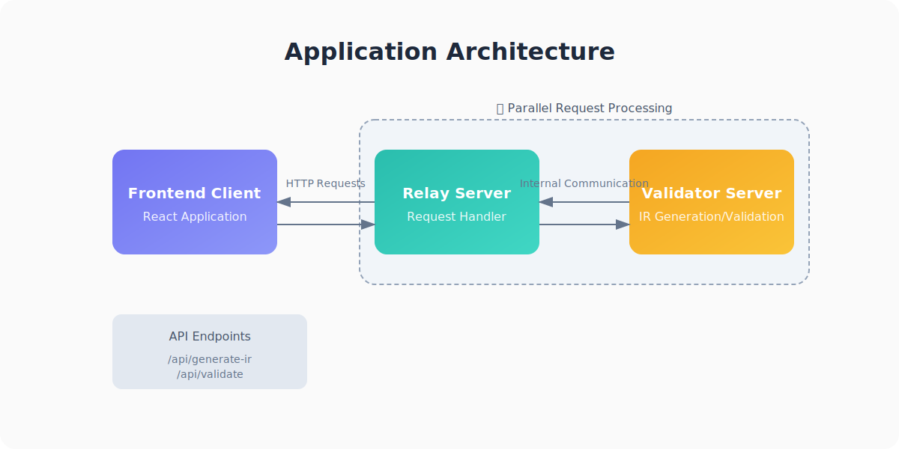
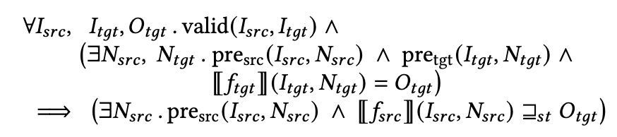

# Translation Validation For LLVM IR(s) <a href="#0">💨</a> From C++ <a href="#0">🤨</a> to Rust <a href="#0">🤩</a>
Zihao Xu @ Purdue University, West Lafayette

# Overview (a.k.a. What's the problem here?) <a href="#overview">🤔</a>
- Rust is becoming popular 🔥
  - nice language features to guarantee the so-called "**memory safety**"
  - looks modern and cool!
  - ~~"fighting with `rustc` makes my day 😅😅😅"~~
- Industries are migrating largely from C++ to Rust
  - surely rewriting everything from top-to-bottom
- And..
  - Rust and C++ are largely different in many aspects
    - semantics/features/type systems/etc..
  - the original C++ code **VS.** the translated Rust code
    - the translation for critical components needs to be verified
    - should be semantically equivalent
    - but what is "**semantic equivalence**"?
      - and in which level?

# Any existing work? <a href="#2">😲</a>
- **CBMC** <a href="https://www.cprover.org/cbmc/" target="_blank">🔗</a>
  - initially for C/C++ bounded model checking
  - check kani <a href="https://model-checking.github.io/kani/getting-started.html" target="_blank">🔗</a> for Rust
  - relies on the **internal GOTO programs** for verification
  - another choice for translation validation between two distinct languages with some tweaks
- **c2rust** <a href="https://c2rust.com" target="_blank">🔗</a>
  - focus more on translation rather than validation
  - for the translation, hmm..
    - source C 📖 → translated Rust 🦀
- **Alive2** <a href="https://github.com/AliveToolkit/alive2" target="_blank">🔗</a> (my choice! 😂😭😅😇🥰)
  - focus on **LLVM IR level's validation**
    - especially for different optimization levels
  - of course, relies on LLVM IR as the shared "semantic space"
    - easy to generate compared to the ***"GOTO programs"*** from CBMC
  - a **"black-box"** 📦..

# My answer <a href="#3">😎</a>
- two distinct versions that uses the same validation logic
  - **Standalone**
    - good for local quick validation
    - can tweak the generated IRs directly
  - **Full-Stack**
    - modern, beautiful[1] user interface to interact with
    - robust backend infrastructure that supports parallel validation(s)
      - **RelayServer** & **ValidatorServer**
    - helpful tooltips to guide (external) users that {may/may not} be familiar with {model checking/alive2/rust/c++/llvm/etc..}.
    - (~~I've spent a lot of time on the {integration/UI/UX/deployment}, so~~ I love this version the most. 😅😍)
- multiple {working/not working} examples <a href="https://github.com/xzhseh/translation_validator/tree/main/examples" target="_blank">🔗</a> to check/test the functionality of alive2.
  - mostly shared by the two versions.

    

    

        
[1] For some definitions of "beautiful".

    

# Standalone
- **Pros:**
  - directly build and run through your terminal!
  - could directly manipulate the generated IRs to test different functionalities
  - flexible and easy to extend
  - contains the option to specify the `ir_fixed` directory to validate
    - but what is `ir_fixed`? and why we need it? 🤨 <a href="#6">📎</a>
- **Cons:**
  - needs to manually write the source C++ code/target Rust code, and generate the IRs through the provided scripts, i.e., `src2ir.py`.
  - hard to interpret the results from alive2

# Full-Stack
> 

- consists of:
  - frontend (i.e., **validator-frontend/**)
  - backend (i.e., **RelayServer** & **ValidatorServer**)
- users could directly write the source C++ code/target Rust code and validate them through the frontend!

# Demo Time! <a href="#demo">🫰🤪🥰😍🤩😎🫰</a>
- Let's first try the standalone version locally..
- **Then let's try it out together!** <a href="https://translation-validator.com" target="_blank">🔗</a> 😎

# Towards the future <a href="#4">🚀</a>
- **Practicality** 🤩 vs. **Impracticality** 😅🤨😅
- Which is the right way to go? 😮‍💨

# Practicality <a href="#4/1">🤩</a>
- Quick & neat tool for simple translation validation
  - good to validate simple (better be pure) function pairs
  - the **swiss army knife** for simple validation
- Utilize the ***"State-Of-The-Art"*** Alive2's validation/verification logic
  - encode robust SMT queries under the hood
  - leverage Z3 solver to reason about the semantic equivalence
  - proved its practicality by finding bugs in LLVM 👍

> 

# Impracticality <a href="#4/2">😅🤨😅</a> (1)
Limitations are (extremely/unexpectedly/expectedly) **HUGE**.. 🤦‍♂️
- unsupported LLVM IR features/instructions are a LOT!
  - `invoke`, `landingpad`, `atomicrmw`, `atomicload`, `atomicstore`, etc.
  - all your favorite concurrent/atomic operations are not supported..
  - quote from alive2's paper [1]
    - 📖
- limited support for validation between cross-language/frontend generated IR pairs
  - hard to directly compare the IR generated by, e.g., `rustc` vs. `clang++`.
  - often need manual modifications/tweaks
    - remember the `ir_fixed`?
  - after all, it's not **"primarily designed"** for this! 🤷‍♂️
    - build your own ***"alive2"*** would then be a complete, different story.

    

    

        
[1] Alive2: Bounded Translation Validation for LLVM. <a href="https://doi.org/10.1145/3453483.3454030" target="_blank">🔗</a>

    

# Impracticality <a href="#4/3">😅🤨😅</a> (2)
- complex function pairs' validation is mostly impossible
  - nested function calls
    - need manually inlining to validate
    - otherwise would be trivially rejected by alive2
      - **"target should always be refined than source"**
  - unexpected function attributes, e.g., ***"noundef"***.
    - automatically generated by frontend in a **purely syntactic** way.
  - language-specific semantics/features
    - special syntax/features (e.g., ownership vs. ***"std::unique_ptr"***)
    - standard library
      - the IRs do not type check **infinitely often**..
    - not to mention the potential (external) runtime
      - e.g., the Rust async runtime ***"tokio"***
- does not scale well with complex patterns/structures

# The right way to go? <a href="#4/4">🧐</a> (1)
- A monolithic, "hardcoded" formal verification tool
  - **Alive2**, **CBMC**, **Dafny** are good examples
  - for broad, general verification between, say, C++ and Rust pairs
    - requires a custom/specific model checker
    - needs a specific, generalized, shared, equivalent IR to help with the verification
      - e.g., the **GOTO programs** from CBMC
      - should take the language-specific semantics/features into consideration
    - extremely hard to generalize
      - lots of, lots of hard-coded stuffs..
    - the above requirements are probably needed for each new language pair's validation
    - hard to have a ***"docker-like"*** graceful solution to accommodate all

# The right way to go? <a href="#4/5">🧐</a> (2)
- By utilizing different high-level/language-specific **tests**
  - Simple Unit Tests
  - Property-Based Testing [1]
  - Fuzzy Testing [2]
  - {E2E/Integration/Deterministic/etc..} Tests
  - only need to ***"translate"*** the tests to be equivalent
  - passing all the tests in both original and translated versions should be good to go
  - but..
  - **is this sufficient?**

    

    

        
[1] & [2]: Brief introduction of Property-Based Testing & Fuzz Testing by Kani. <a href="https://model-checking.github.io/kani/tool-comparison.html#comparison-with-other-tools" target="_blank">🔗</a>

    

# The right way to go? <a href="#4/6">🧐</a> (3)
- Hybrid approach
  - for those currently **hard-to-support** validation pairs
    - use the second approach to help verify the "**high-level**" semantic equivalence
    - different combinations of tests could likely catch most of the **semantic discrepancies** between the original and translated code.
  - for single function modules, treat them as "black-box" and apply formal verification by existing tools
    - may need some tweaks
    - e.g., manual inlining, converting the function modules, etc.
  - **"have the cake and eat it too!"** 🤤

# Ending <a href="#5">🥳🥳🥳</a>
> **"What I cannot build, I do not understand."** — Richard Feynman

- My last project at Purdue.
- It feels good to write code.
- After all, Computer Science is beautiful [1].

    

    

        
[1] As always, for some definitions of "beautiful".

    

# ir_fixed? <a href="#3/1">🔙</a>
- a collection of the IR files that are manually ***"fixed"*** by me
- could be used to compare with the normal IR files to see the differences
- may be accompanied by an explanation file in each directory to record the changes made and the reasons.
- example of `add` <a href="https://github.com/xzhseh/translation_validator/blob/main/examples/ir_fixed/add/note.md" target="_blank">🔗</a>
  - `clang` adds the `nsw` flag (and the potential `noundef` attribute) in a **purely syntactic**[1] way.
    - by strictly following the **C++ language specification**, the `nsw` flag is added to the `add` instruction in the generated LLVM IR.
  - the subsequent passes ignore this attribute and generate targets without the `nsw` flag.
    - leads to the ***"verification success"*** when validated by alive2..
    - where the original C++ code obviously has different semantics compared to the translated Rust code.

    

    

        
[1] That is, without considering the actual language semantics.

    

